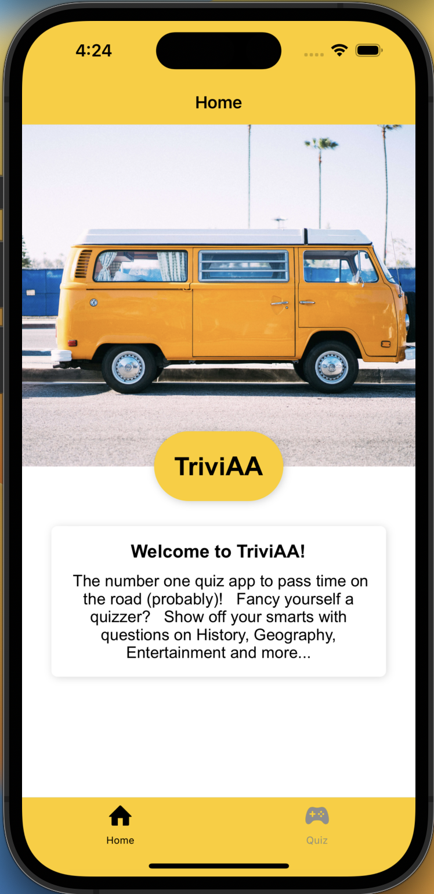
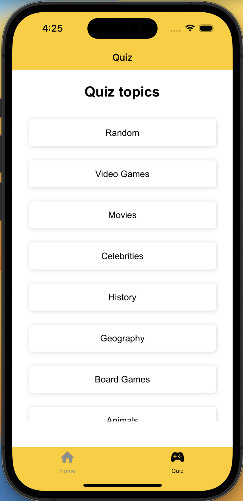
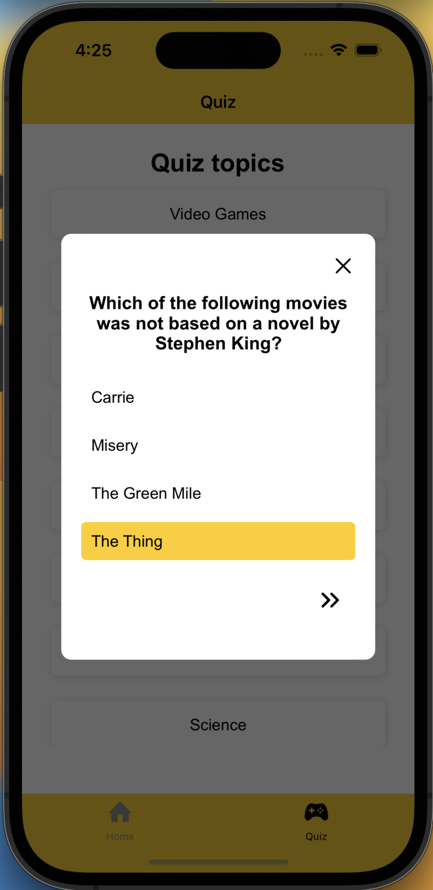
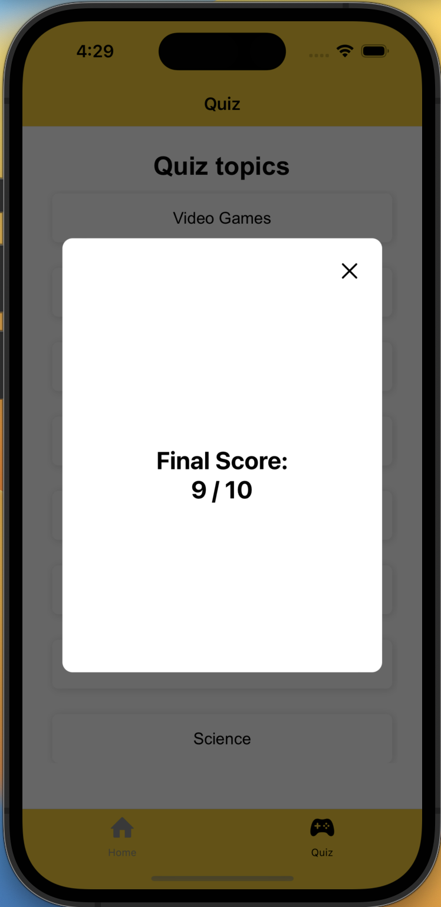

# TriviAA

TriviAA is a mobile quiz app I have built using React Native, it is fully compatible with both iOS and Android devices. All trivia questions are retrieved from the [Open Trivia DB]([https://www.sita.aero](https://opentdb.com/api_config.php))

# Screenshots - iOS

     

     
